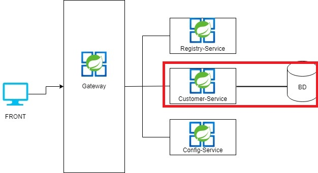

# intercorp Microservicio de Clientes

1. Descripcion de funcionamiento:
Para la arquitectura de microservicios de este pequeño proyecto se realizo 1 proyecto donde interactua con la BD para realizar las funcionalidades deseadas.
   

Otras herramientas de la arquitectura de microservicios.
- Gateway-Service: Punto de acceso de todos los microservicios.
- Registry-Service: Registrar los microservicios
- Config-Service: Registrar las configuraciones de los microservicios de forma centralizada.

2. Pasos de instalacion:
A continuacion se detallará la instalación del proyecto para la pruebas de los endpoints.

2.1. Base de Datos:

Ejecutar el [script](BD.sql) para crear la BD

2.2 Levantar proyecto:

Script: mvn spring-boot:run -Dspring-boot.run.arguments="--spring.datasource.username=XXXXXXXXX --spring.datasource.password=XXXXXXXX"

Completar el user y password de la BD.

3. Pruebas de los endpoints:

   Importar el collection en postman: [Collection](IntercorpPrueba%20Gateway.postman_collection.json)
   En el proyecto de customer-service hay 3 endpoints, se detalla a continuacion:
- searchCustomer: Busca los clientes por id(numero de documento) y/o email; si no ingresa ningun filtro, devuelve toda la lista de los clientes.
- saveCustomer: Registrar un nuevo cliente a la BD (todos los campos son obligatorios)
- calculateIndicators: Calcula los indicadores de tasa de natalidad de un mes/año, ademas trae el indicador de todos los mes/años que se encuentren en la BD.

